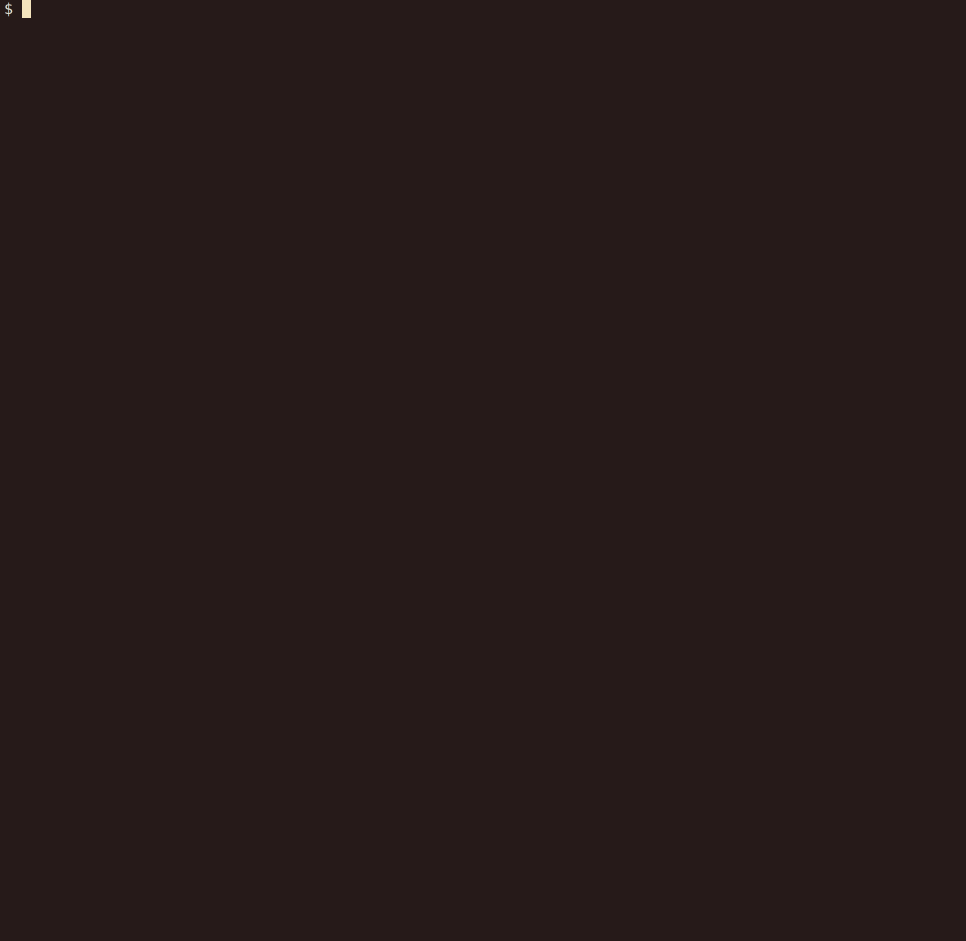
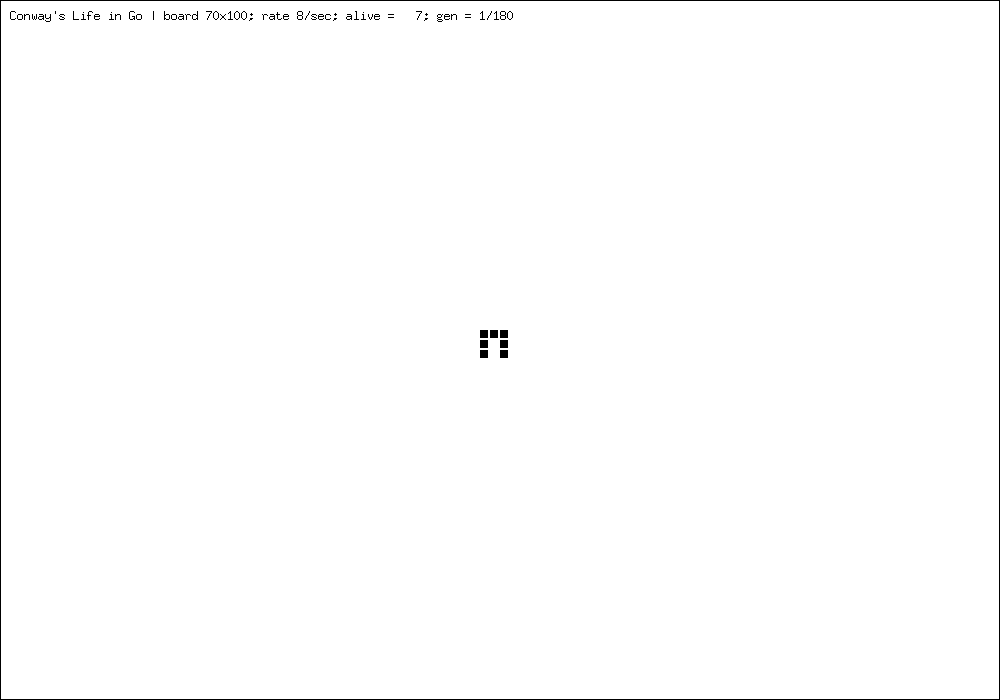
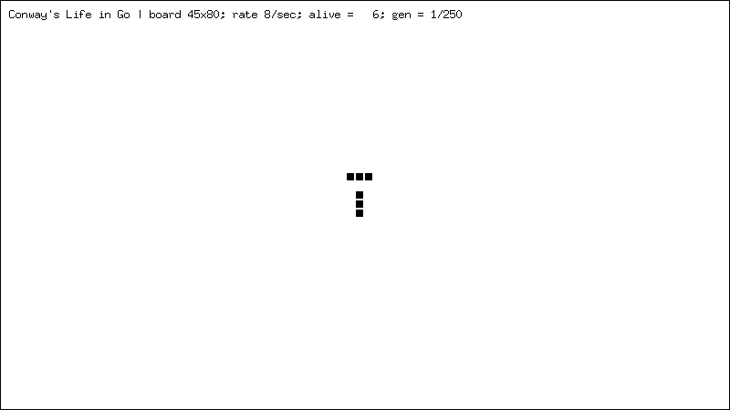

# Conway's Life simulation in Go

Small and simple Conway's Life terminal simulator project exploring Go languague. 

Conway's Game of Life, also known as the Game of Life or simply Life, is a cellular automaton devised by the British mathematician John Horton Conway in 1970. It is the best-known example of a cellular automaton. Ever since its publication, Conway's Game of Life has attracted much interest because of the surprising ways in which the patterns can evolve.

Read more about Conway's Life [here](http://www.conwaylife.com/wiki/Conway%27s_Game_of_Life). On the same wiki, you can find a lot of interesting patterns and corresponding LIF files, which this program can load and simulate their evolution.

The project has three different implementations with different features:

- Quick and simple with approx 100 lines of code
- More features with old-facioned classical procedural approach
- Most feature rich with oop-style approach (number of features have nothing to do with approaches :) )

Examples below use oop-style version.

## Build

```
git clone https://github.com/ivanpesin/golang-life.git
cd golang-life/cmd/oop-style
go build -ldfages="-s -w" -o life life-oop.go 
```

## Usage

```
$ ./life -h
Conway's Life simulator in Go:
  Text-mode or animated gif simulation according to B2/S23 rules.

Usage:
  -color
    	In text-mode use color to show cell age
  -cols int
    	Number of cols (default 78)
  -deltax int
    	X translation for loaded shape (centered by default)
  -deltay int
    	Y translation for loaded shape (centered by default)
  -f string
    	Load life pattern from LIF 1.05/1.06 file
  -gif string
    	Instead of text-mode, generate animated GIF file with
    	specified name containing the evolution.
  -r int
    	Rate of generations per second (default 2)
  -rows int
    	Number of rows (default 22)
  -shape
    	In text-mode use shapes to show cell age
  -turns int
    	Number of generations to simulate
```

## Text-mode demonstation

## Pi-heptomino

>Pi-heptomino is a common heptomino that stabilizes at generation 173, leaving behind six blocks, five blinkers and two ponds. 

http://www.conwaylife.com/wiki/Pi-heptomino 



## Thunderbird

>Thunderbird is a methuselah that stabilizes after 243 generations. Its stable pattern has 46 cells and consists of four blinkers, four beehives and two boats.

http://www.conwaylife.com/wiki/Thunderbird

The program supports plain-text mode, as well as colored and shaped, where color and shape represents the age of a cell:


Variant with shapes enabled:


Now with color enabled but not shape:


Finally, both color and shape:


## GIF demonstation

The program allows to generate an animated GIF file with evolution, here are some examples:

**Pi-heptomino**



**Thunderbird**


